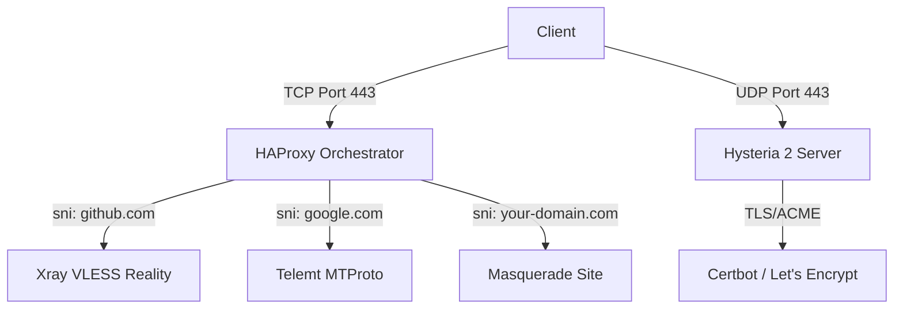

# 🌌 Ohmyblock - Proxy Orchestrator


**English Version** | [Russian Version](README_RU.md)

**Ohmyblock** is an infrastructure environment for deploying personal proxy nodes. The project provides automation and streamlined multi-user access management.

This solution integrates three protocols into a unified system, managed via HAProxy and a Bash automation layer.

---

## 🏗 System Architecture

The project implements a hybrid architecture that separates TCP and UDP streams to achieve maximum efficiency and invisibility to Deep Packet Inspection (DPI) systems.

### 1. TCP Orchestration (HAProxy)
All TCP activity is concentrated on a single entry port (standardly **443**). HAProxy acts as a "smart dispatcher," analyzing the SNI (Server Name Indication) and distributing requests:
-   **VLESS Reality (xhttp)**: Masked as trusted resources (e.g., `github.com`).
-   **Telemt (MTProto)**: MTProto proxy for Telegram with Fake-TLS support (masked as `google.com`).
-   **Hysteria 2 Site**: Redirects standard HTTPS requests to an internal masquerade web server.

### 2. UDP Acceleration (Hysteria 2)
Hysteria 2 works directly on port **443 UDP** using the QUIC protocol. This provides phenomenal speeds even on unstable networks with high packet loss.



---

## 💎 Supported Protocols

### 🛰 VLESS Reality (Xray-core)
*   **Transport**: xhttp (the most modern and stable data transmission method).
*   **Stealth**: Reality technology allows the server to perfectly copy the TLS stack behavior of a popular website, making proxy detection nearly impossible.

### ⚡ Hysteria 2
*   **Transport**: QUIC (UDP).
*   **Key Feature**: Efficient congestion control, maintaining stable speeds on restricted network channels.

### 💬 Telemt (MTProto)
*   **Purpose**: Proxy for Telegram.
*   **Convenience**: Generates direct `tg://` and `https://t.me/` links for quick client configuration.

---

## 🌐 Critical Domain Requirements

A **real domain is mandatory** for Hysteria 2 to function properly and to obtain automatic SSL certificates from Let's Encrypt.

> [!IMPORTANT]
> Hysteria 2 requires a valid SSL certificate for full speed and security. The system automatically uses Certbot to issue and renew certificates; therefore, your domain must have an **A-record** pointing to your server's IP.

### How to get a domain for free?
If you don't have a registered domain, you can use the **[freedns.afraid.org](https://freedns.afraid.org/)** service:
1. Go to the website and sign up.
2. Under **"Registry"**, choose any available public domain.
3. Create your own subdomain (e.g., `myvpn.mooo.com`).
4. Set the destination to your server's IP.

---

## 🚀 Installation

Run the script on a clean Ubuntu system (recommended 22.04 or 24.04):

```bash
# Download the script
wget https://raw.githubusercontent.com/devraces/ohmyblock/refs/heads/main/ohmyblock.sh

# Set executable permissions
chmod +x ohmyblock.sh

# Run the installation
./ohmyblock.sh
```

### Automation includes:
- **BBR** (TCP Bottleneck Bandwidth and RR) optimization for network speed.
- Generation of unique **UUIDs** and **Reality Keys**.
- **UFW** (Firewall) installation and configuration.
- Deployment and auto-start of all necessary daemons.

---

## 🛠 Management CLI Tools

Post-installation, professional management tools are at your disposal:

| Command | Description |
| :--- | :--- |
| `newuser` | Create a user in all services simultaneously. |
| `rmuser` | Remove a user from all configurations. |
| `userlist` | List all active usernames. |
| `sharelink` | Display all links and QR codes for a selected user. |
| `mainuser` | Quick access to the first user's connection details. |
| `proxystatus` | Check service health and monitor ports. |
| `tglink` | Connection link for the Telegram proxy. |
| `hy2info` | Hysteria 2 connection information. |

---

## 📂 Configuration Locations

-   **Xray**: `/usr/local/etc/xray/config.json`
-   **HAProxy**: `/etc/haproxy/haproxy.cfg`
-   **Hysteria 2**: `/etc/hysteria/config.yaml`
-   **Users DB**: `/usr/local/etc/proxy/users.json`
-   **Keys**: `/usr/local/etc/xray/.keys`

---
**Designed for freedom and privacy.**
