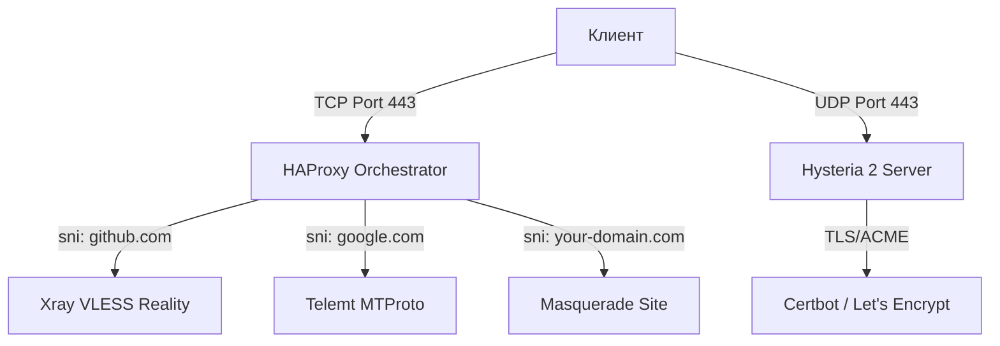

# 🌌 Ohmyblock - Прокси оркестратор


[English Version](README.md) | **Русская версия**

**Ohmyblock** — это инфраструктурная среда для развертывания персональных прокси-серверов. Проект обеспечивает автоматизацию и удобство управления многопользовательским доступом.

Решение объединяет три протокола в единую систему, управляемую через HAProxy и слой автоматизации на Bash.

---

## 🏗 Архитектура Системы

Проект реализует гибридную архитектуру, разделяющую TCP и UDP потоки для достижения максимальной эффективности и незаметности для систем анализа трафика (DPI).

### 1. TCP Orchestration (HAProxy)
Вся TCP-активность сосредоточена на одном входном порту (стандартно **443**). HAProxy выступает в роли "умного диспетчера", анализируя SNI (Server Name Indication) и распределяя запросы:
-   **VLESS Reality (xhttp)**: Маскируется под доверенные ресурсы (например, `github.com`).
-   **Telemt (MTProto)**: Прокси для Telegram с поддержкой Fake-TLS (маскировка под `google.com`).
-   **Hysteria 2 Site**: Перенаправляет обычные HTTPS-запросы на внутренний веб-сервер-заглушку.

### 2. UDP Acceleration (Hysteria 2)
Hysteria 2 работает напрямую на порту **443 UDP**, используя протокол QUIC. Это обеспечивает феноменальную скорость даже на нестабильных каналах с потерями пакетов.



---

## 💎 Ключевые Протоколы

### 🛰 VLESS Reality (Xray-core)
*   **Транспорт**: xhttp (наиболее современный и стабильный способ передачи данных).
*   **Скрытность**: Технология Reality позволяет серверу полностью копировать поведение TLS-стека популярного сайта, исключая возможность детектирования прокси.

### ⚡ Hysteria 2
*   **Транспорт**: QUIC (UDP).
*   **Особенность**: Эффективный контроль перегрузки, позволяющий сохранять стабильную скорость на каналах с ограничениями.

### 💬 Telemt (MTProto)
*   **Назначение**: Прокси для Telegram.
*   **Удобство**: Генерация прямых ссылок `tg://` и `https://t.me/` для быстрой настройки клиента.

---

## 🌐 Важные требования к Домену

Для работы **Hysteria 2** и автоматического получения SSL-сертификатов от Let's Encrypt **наличие домена обязательно**.

> [!IMPORTANT]
> Hysteria 2 требует валидный SSL-сертификат для работы на полной скорости и обеспечения безопасности. Система автоматически использует Certbot для выпуска и продления сертификатов, поэтому ваш домен должен иметь **A-запись**, указывающую на IP вашего сервера.

### Как получить домен бесплатно?
Если у вас нет зарегистрированного домена, вы можете воспользоваться сервисом **[freedns.afraid.org](https://freedns.afraid.org/)**:
1. Перейдите на сайт и зарегистрируйтесь.
2. В разделе **"Registry"** выберите любой доступный публичный домен.
3. Создайте свой поддомен (например, `myvpn.mooo.com`).
4. В настройках укажите IP-адрес вашего сервера.

---

## 🚀 Установка

Запустите скрипт на чистой системе Ubuntu (рекомендуется 22.04 или 24.04):

```bash
# Скачивание скрипта
wget https://raw.githubusercontent.com/devraces/ohmyblock/refs/heads/main/ohmyblock.sh

# Установка прав на исполнение
chmod +x ohmyblock.sh

# Запуск установки
./ohmyblock.sh
```

### Автоматизация процесса:
- Настройка **BBR** (TCP Bottleneck Bandwidth and RR) для ускорения сети.
- Генерация уникальных **UUID** и **Reality Keys**.
- Установка и конфигурация **UFW** (Firewall).
- Развертывание всех необходимых демонов и их автозагрузка.

---

## 🛠 Команды управления (CLI)

После установки вам доступны профессиональные инструменты управления:

| Команда | Описание |
| :--- | :--- |
| `newuser` | Создать пользователя сразу во всех сервисах. |
| `rmuser` | Удалить пользователя из всех конфигураций. |
| `userlist` | Список всех активных имен пользователей. |
| `sharelink` | Вывести все ссылки и QR-коды для выбранного юзера. |
| `mainuser` | Быстрый доступ к ссылкам первого пользователя. |
| `proxystatus` | Проверка состояния служб и мониторинг портов. |
| `tglink` | Ссылка для подключения Telegram-прокси. |
| `hy2info` | Информация о подключении Hysteria 2. |

---

## 📂 Расположение конфигураций

-   **Xray**: `/usr/local/etc/xray/config.json`
-   **HAProxy**: `/etc/haproxy/haproxy.cfg`
-   **Hysteria 2**: `/etc/hysteria/config.yaml`
-   **Users DB**: `/usr/local/etc/proxy/users.json`
-   **Keys**: `/usr/local/etc/xray/.keys`

---
**Разработано для обеспечения свободы и приватности.**
